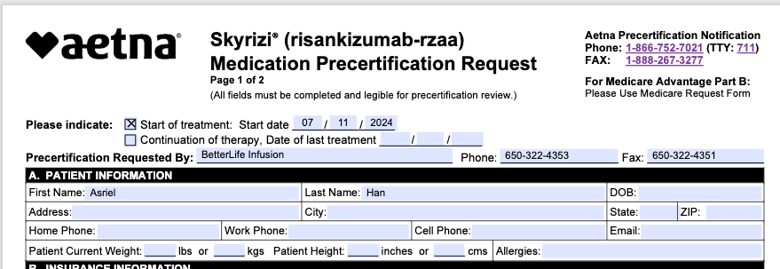

### Task: Automate the Prior Authorization (PA) Form Filling Workflow

---

### **Purpose of this assignment**

This task is designed to assess the candidate's skills, creativity, and problem-solving abilities in a practical setting. Specifically, we are looking for:

1. The ability to quickly learn and adapt to domain knowledge (in this case, healthcare) from a new vertical.
2. Existing skills and knowledge in building multimodal ML pipelines.
3. The capacity to think outside of the box, discovering novel solutions when existing methods fall short.
4. The ability to effectively leverage existing resources, tools, and libraries to resolve challenges.
5. Strong fundamental coding skills, including clean, readable, and maintainable code.
6. Thoughtful handling of ambiguous or incomplete requirements, demonstrating sound judgment in decision-making.

### Background:

**Prior Authorization (PA)** is a process where healthcare providers must obtain approval from a health insurance plan before delivering a specific service (e.g., a drug infusion) to a patient. This process requires assembling evidence to demonstrate that the patient meets specific criteria, such as:

- **Severity of illness**
- **Ineffectiveness of alternative treatments**

The process typically involves comparing two main documents:

1. **PA Form:**  
   A structured PDF form specific to a drug, containing fields for the required information needed for insurance approval.

2. **Supporting Documentation (Referral Package):**  
   A collection of scanned documents such as:
   - Insurance card
   - Medical history notes
   - Test results  
     These are combined into a single PDF, often sent via fax as high-resolution images.

After comparing the documents and confirming that all criteria are met, the PA request is submitted.

---

### Current Manual Workflow:

Currently, a human worker performs the following steps:

1. **Download the PA Form:**  
   Retrieve the specific drug's form from the insurance company's website.

2. **Review the Referral Package:**  
   Extract necessary information from the referral package to complete the PA form.

3. **Complete the PA Form:**  
   Fill in the required fields on the PA form using information from the referral package.

---

### Goal:

Develop a pipeline to automate this workflow.

- **Input:**  
  Pairs of PA forms and referral packages provided in the input data folder. Input data structure is as follow:

      📁 Input Data

          📁 Patient A

              📄 PA.pdf

              📄 referral_package.pdf

          📁 Patient B

              📄 PA.pdf

              📄 referral_package.pdf

          📁 Patient C

              ...

  The dataset includes approximately 10 referrals and 10 different types of forms for different drugs from different insurance companies. **The pipeline should be designed to generalize to any form and any drug, even those unseen during development.**

- **Output:**
  - For each patient, the primary output is a **filled PA form as a PDF document**. This PDF will be populated with information extracted and inferred from the provided referral package. Fields for which information could not be found will remain blank on the form.
  - Accompanying the filled PDF, a **separate report (e.g., a text or markdown file) must be generated for each patient, listing any required fields for which information was missing** from the referral package. This report will clearly indicate what information could not be populated.
  - The example image below illustrates the general appearance of a filled PA form. Your pipeline will generate the actual filled PDF document.
    

---

### Notes:

1. **Referral Package Complexity:**

   - These packages consist of multiple scanned documents combined into a single PDF.
   - Since these are high-resolution images, text cannot be directly extracted using standard PDF libraries (e.g., PyMuPDF). Optical Character Recognition (OCR) is required.

2. **PA Form Structure:**

   - Unlike referral packages, PA forms are well-structured PDFs with retrievable text blocks, making field identification more straightforward.

3. **PA Fields Format:**

   - Not every field in a PA form should be filled out. The form often contains mutually exclusive options and branching paths, particularly in checkbox sections. For example:

     1. If you check "New Patient", you shouldn't also check "Existing Patient"
     2. Selecting certain options may make other sections irrelevant or inapplicable
     3. Some sections are conditional and should only be completed based on previous answers

     The goal is to fill out only the appropriate fields based on the patient's specific situation and the logical flow of the form, not to complete every possible field.

4. **Form Types and Implementation Priority:**

   - PA forms come in two formats: interactive widget-based PDFs (containing AcroForm widgets) and non-widget-based PDFs.
   - The primary expectation is for the pipeline to work with widget-based PDFs that contain fillable form fields.
   - While the solution should be designed to handle any form type, successfully implementing support for non-widget-based PDFs will be considered a bonus achievement.
   - The solution should prioritize robust handling of interactive widget-based forms first, then extend capabilities to non-widget formats if possible.

### Delivery Requirement:

1. **Submission Format:**

   - The automated pipeline, along with all supporting materials, must be submitted as a new branch named `automation-pa-filling-[your name]` in the GitHub repository. Do **not** push changes directly to the `main` branch.

2. **Required Deliverables:**
   - **Source Code:**
     - Implement the complete pipeline for automating the PA form-filling workflow. Code should be modular, readable, and include appropriate comments.
   - **Documentation:**
     - Replace the current `README.md` file with your own documentation that includes:
       - Step-by-step installation instructions
       - Your thought process on how you implement
       - Any assumptions or limitations of the implementation
     - Additional documentation in the `docs/` folder if necessary, such as architectural diagrams, workflows, or examples of the expected outputs.
   - **Output Examples:**
     - Include examples of the **filled PA form PDFs** and their **corresponding missing information reports** for the sample input data. These examples will demonstrate the expected pipeline behavior and output format. It is recommended to store these example files in a dedicated directory (e.g., `output_examples/`).
